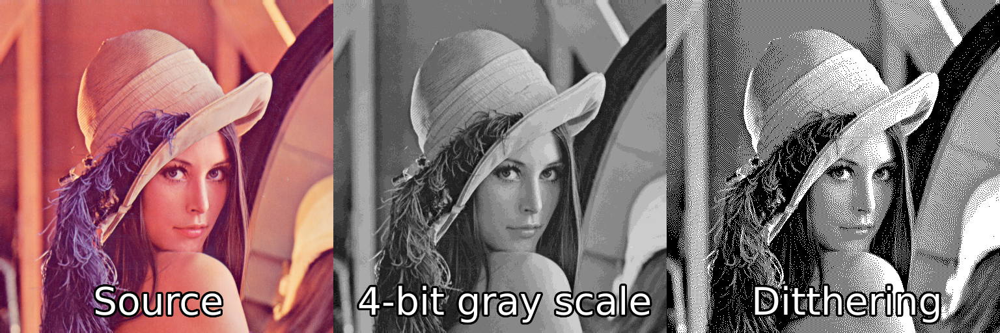

## Description
Image converter for use in combination with embedded systems that utilize monochromatic display.



__As of now only 8-bit RGB/RGBA png image format is supported.__

This application is capable of:
- Converting input image to gray scale (_with variable bit depth_);
- Image resizing (_Nearest Neighbor image scaling algorithm_);
- Application of dithering effect (_Floyd-Steinberg dithering algorithm with slightly changed error calculation_)
- (**WIP**) Saving raw pixel data in a output _txt_ file. In two mods:
	- One pixel per byte "normal mode";
	- Two pixels per byte "packed mode" (_this mode is mostly used for displays with drivers such as SSD1322_); __!!! This mode can only be used if color depth is less than 16 !!!__

## How it works

Image modification pipeline has following stages is this order:
- Input (_file opening and extraction of raw pixel data_)
- Convertion to gray scale (_with selected number of shades of gray_)
- Image resizing (_optional_)
- Ditthering (_optional_)

## How to use
Usage: `imgConv [OPTINS]`

Options:
- `-i`    &emsp;-    &emsp;Path to input image
- `-o`    &emsp;-    &emsp;Path to output file (_C header_)
- `-g`    &emsp;-    &emsp;Number of shades of gray
- `-s`    &emsp;-    &emsp;Image scale (-s _width height_) (-s _number_)
- `-p`    &emsp;-    &emsp;Pack two pixels in one byte (only if gray <= 16)
- `-d`    &emsp;-    &emsp;Apply dithering to the image
- `-v`    &emsp;-    &emsp;Save result as a png image
- `-h`    &emsp;-    &emsp;Help

### Examples
Apply ditthering:
```shell
./imgConv -i lena_std.png -o <output file name> -g 255 -d
```

Resize image and reduce nume of shades of gray:
```shell
./imgConv -i lena_std.png -o <output file name> -g 16 -s 320 240
```

Resize image to become square:
```shell
./imgConv -i lena_std.png -o <output file name> -g 16 -s 240
```

Apply ditthering and save result as an image:
```shell
./imgConv -i lena_std.png -o <output file name> -g 255 -d -v
```
